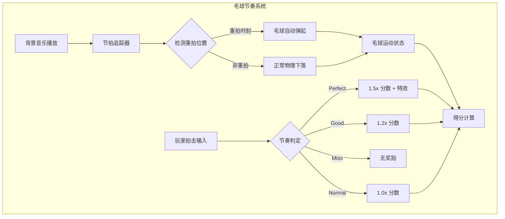
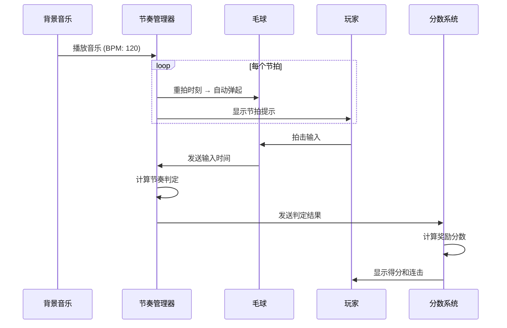
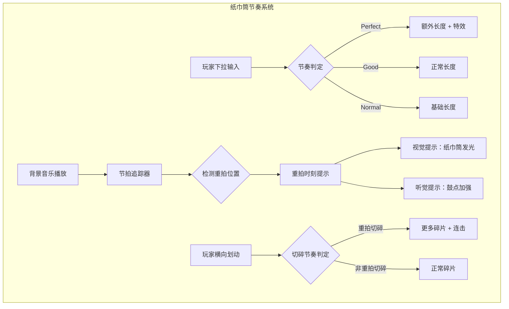
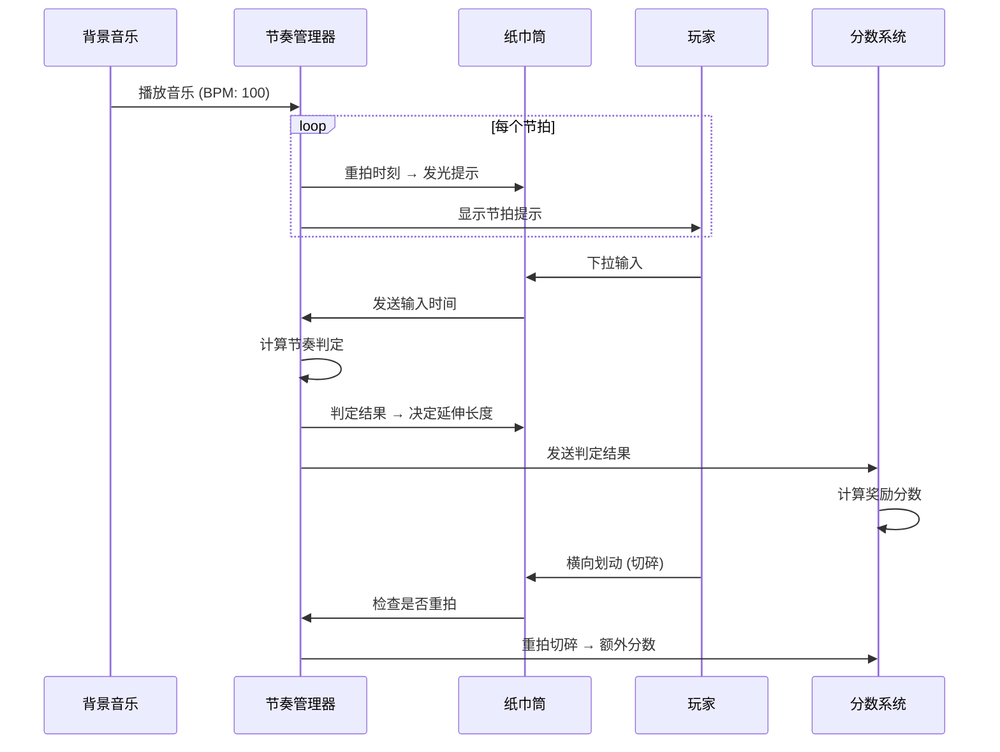

# 音乐节奏小游戏开发计划

## 项目概述

**项目名称**: HaChiMiOhNameruDo（ハチミオナメルド）  
**核心理念**: 休闲小游戏 + 音乐节奏元素  
**设计原则**: 不强制玩家按节奏交互，但踩准节拍会有奖励

---

## 一、核心节奏系统设计

### 1.1 节奏管理器 (RhythmManager)

```
HaChiMiOhNameruDo.Managers
└── RhythmManager (新增)
    ├── BPM (Beats Per Minute) - 音乐节拍速度
    ├── BeatListener - 节拍监听器
    ├── RhythmInputDetector - 节奏输入检测
    └── RhythmRewardSystem - 节奏奖励系统
```

#### 核心功能

| 功能 | 描述 |
|------|------|
| **节拍追踪** | 实时追踪当前音乐的节拍位置 |
| **节奏窗口检测** | 检测玩家输入是否在"完美"、"良好"、"普通"窗口内 |
| **连击系统** | 连续踩准节拍时增加连击数 |
| **奖励倍率** | 根据节奏准确度给予分数倍率 |

#### 节奏判定窗口

```
完美 (Perfect): ±50ms   → 1.5x 分数倍率 + 特效
良好 (Good):    ±100ms  → 1.2x 分数倍率
普通 (Normal):  ±200ms  → 1.0x 分数倍率
未命中 (Miss):  >200ms  → 无奖励
```

### 1.2 节奏数据结构

```csharp
// 节奏判定结果
public enum RhythmJudgment
{
    Perfect,    // 完美
    Good,       // 良好
    Normal,     // 普通
    Miss        // 未命中
}

// 节奏事件
public class RhythmHitEvent
{
    public float beatPosition;      // 节拍位置
    public RhythmJudgment judgment; // 判定结果
    public float timingOffset;      // 时间偏移 (ms)
    public int combo;               // 连击数
}
```

---

## 二、毛球小游戏节奏化改造

### 2.1 当前状态

- ✅ 基础拍击机制已完成
- ✅ 毛球抛起和落下逻辑
- ❌ 缺少节奏元素
- ❌ 缺少奖励系统

### 2.2 节奏化设计方案

#### 系统架构图



#### 新增组件

| 组件名 | 职责 |
|--------|------|
| `FurBallRhythmController` | 毛球节奏控制器，根据音乐节拍控制毛球弹起时机 |
| `FurBallBeatVisualizer` | 节拍可视化，显示下一个重拍时机 |
| `FurBallScoreManager` | 分数管理，计算节奏奖励 |

#### 游戏流程



#### 节奏奖励机制

| 交互时机 | 判定 | 奖励 |
|----------|------|------|
| 重拍瞬间拍击 | Perfect | 1.5x 分数 + 闪光特效 + 连击 +1 |
| 重拍前后 100ms | Good | 1.2x 分数 + 连击 +1 |
| 重拍前后 200ms | Normal | 1.0x 分数 |
| 非重拍时机 | Miss | 0.5x 分数，连击重置 |

#### 连击奖励

```
连击数     倍率奖励
5 连击     +10% 分数
10 连击    +25% 分数
20 连击    +50% 分数
30 连击    +100% 分数 (Fever 模式)
```

---

## 三、纸巾筒小游戏节奏化改造

### 3.1 当前状态

- ✅ 基础抽纸机制已完成
- ✅ 厕纸延伸和切碎逻辑
- ❌ 缺少节奏元素
- ❌ 缺少奖励系统

### 3.2 节奏化设计方案

#### 系统架构图



#### 新增组件

| 组件名 | 职责 |
|--------|------|
| `TissueRhythmController` | 纸巾筒节奏控制器 |
| `TissueBeatIndicator` | 节拍指示器（纸巾筒发光效果） |
| `TissueScoreManager` | 分数管理 |

#### 游戏流程



#### 节奏奖励机制

**下拉抽纸**:

| 交互时机 | 判定 | 奖励 |
|----------|------|------|
| 重拍瞬间下拉 | Perfect | 2x 长度 + 闪光特效 |
| 重拍前后 100ms | Good | 1.5x 长度 |
| 重拍前后 200ms | Normal | 1.0x 长度 |
| 非重拍时机 | Miss | 0.5x 长度 |

**横向切碎**:

| 交互时机 | 判定 | 奖励 |
|----------|------|------|
| 重拍瞬间切碎 | Perfect | 3x 碎片数 + 连击 +2 |
| 重拍前后 100ms | Good | 2x 碎片数 + 连击 +1 |
| 非重拍时机 | Normal | 1x 碎片数 |

---

## 四、未来小游戏规划

### 4.1 建议的新小游戏类型

| 游戏名 | 核心玩法 | 节奏元素 |
|--------|----------|----------|
| **尾巴摇摆** | 猫咪尾巴随音乐摇摆，玩家点击停止 | 在重拍时停止获得高分 |
| **爪子打地鼠** | 地洞随节奏出现，玩家拍击 | 按节奏连续拍击 |
| **毛线球滚动** | 毛线球在节奏轨道上滚动 | 在正确时机转向 |
| **猫咪唱歌** | 猫咪随音乐发出叫声 | 玩家跟唱/点击对应音符 |

### 4.2 通用节奏系统组件

```
HaChiMiOhNameruDo.MiniGames
├── Common/
│   ├── RhythmTrack.cs          # 节奏轨道（显示节拍线）
│   ├── BeatMarker.cs           # 节拍标记
│   ├── RhythmInputHandler.cs   # 节奏输入处理器
│   └── RhythmFeedbackUI.cs     # 节奏反馈 UI(Perfect/Good 显示)
```

---

## 五、技术实现细节

### 5.1 节拍追踪算法

```csharp
// 伪代码示例
public class RhythmManager : MonoBehaviour
{
    [SerializeField] private float bpm = 120f;
    [SerializeField] private float beatSnapThreshold = 0.1f; // 100ms
    
    private float beatDuration;
    private float currentBeatTime;
    private int currentBeat;
    
    void Start()
    {
        beatDuration = 60f / bpm;
    }
    
    void Update()
    {
        currentBeatTime += Time.deltaTime;
        
        // 检测是否到达新节拍
        if (currentBeatTime >= beatDuration)
        {
            currentBeat++;
            currentBeatTime -= beatDuration;
            OnBeatHit(currentBeat);
        }
    }
    
    public RhythmJudgment CheckRhythmInput(float inputTime)
    {
        float distanceToNearestBeat = Mathf.Abs(currentBeatTime - inputTime);
        
        if (distanceToNearestBeat <= 0.05f) return RhythmJudgment.Perfect;
        if (distanceToNearestBeat <= 0.10f) return RhythmJudgment.Good;
        if (distanceToNearestBeat <= 0.20f) return RhythmJudgment.Normal;
        return RhythmJudgment.Miss;
    }
}
```

### 5.2 音频配置建议

| 属性 | 建议值 |
|------|--------|
| **BPM 范围** | 80-140 (休闲向) |
| **节拍强调** | 明显的鼓点/贝斯 |
| **音乐风格** | Lo-fi、Chill、Jazz Hop |
| **音频格式** | .wav 或高质量 .mp3 |

---

## 六、开发优先级

### Phase 1: 核心节奏系统 (高优先级)

- [ ] 创建 `RhythmManager` 单例
- [ ] 实现节拍追踪算法
- [ ] 创建节奏判定系统
- [ ] 添加连击和奖励倍率系统
- [ ] 创建通用节奏 UI 组件

### Phase 2: 毛球小游戏节奏化 (高优先级)

- [ ] 创建 `FurBallRhythmController`
- [ ] 实现重拍自动弹起机制
- [ ] 添加节拍可视化提示
- [ ] 集成节奏奖励系统
- [ ] 添加 Perfect/Good 特效

### Phase 3: 纸巾筒小游戏节奏化 (中优先级)

- [ ] 创建 `TissueRhythmController`
- [ ] 实现纸巾筒发光提示
- [ ] 调整抽纸长度计算
- [ ] 集成切碎节奏奖励
- [ ] 添加连击系统

### Phase 4: 新小游戏开发 (低优先级)

- [ ] 设计新小游戏概念
- [ ] 实现基础玩法
- [ ] 集成节奏系统
- [ ] 平衡游戏难度

---

## 七、UI/UX 设计

### 7.1 节奏提示 UI

```
┌─────────────────────────────────┐
│                                 │
│     ╔═══════════════════╗       │
│     ║   NEXT BEAT → ●   ║       │  ← 节拍预测指示器
│     ╚═══════════════════╝       │
│                                 │
│         ┌─────────┐             │
│         │  CAT    │             │
│         │  IMAGE  │             │
│         └─────────┘             │
│                                 │
│    ╭─────────────────────╮      │
│    │  Perfect!  Combo x5 │      │  ← 节奏反馈
│    ╰─────────────────────╯      │
│                                 │
│         Score: 12,500           │
│         Multiplier: 1.5x        │
└─────────────────────────────────┘
```

### 7.2 视觉反馈

| 判定 | 颜色 | 特效 |
|------|------|------|
| Perfect | 金色 | 闪光 + 粒子爆发 |
| Good | 绿色 | 轻微闪光 |
| Normal | 白色 | 无特效 |
| Miss | 灰色 | 连击破碎动画 |

---

## 八、测试与调优

### 8.1 测试项目

1. **节奏准确性测试**: 验证判定窗口是否准确
2. **不同 BPM 测试**: 测试 80-140 BPM 范围内的表现
3. **输入延迟测试**: 测试触摸/鼠标输入的延迟
4. **音频同步测试**: 验证音频与视觉同步

### 8.2 调优参数

```csharp
// 可调整参数
[Header("节奏判定")]
public float perfectWindow = 0.05f;    // 50ms
public float goodWindow = 0.10f;       // 100ms
public float normalWindow = 0.20f;     // 200ms

[Header("奖励倍率")]
public float perfectMultiplier = 1.5f;
public float goodMultiplier = 1.2f;
public float normalMultiplier = 1.0f;

[Header("连击奖励")]
public int feverComboThreshold = 30;   // 30 连击进入 Fever
public float feverBonusMultiplier = 2.0f;
```

---

## 九、文件结构规划

```
Assets/Scripts/
├── Managers/
│   ├── RhythmManager.cs           # 新增：节奏管理器
│   └── ...
├── MiniGames/
│   ├── Common/
│   │   ├── RhythmTrack.cs         # 新增：节奏轨道
│   │   ├── BeatMarker.cs          # 新增：节拍标记
│   │   ├── RhythmInputHandler.cs  # 新增：节奏输入处理
│   │   └── RhythmFeedbackUI.cs    # 新增：节奏反馈 UI
│   ├── FurBallGame/
│   │   ├── FurBallRhythmController.cs  # 新增
│   │   ├── FurBallBeatVisualizer.cs    # 新增
│   │   └── FurBallScoreManager.cs      # 新增
│   └── TissueGame/
│       ├── TissueRhythmController.cs   # 新增
│       ├── TissueBeatIndicator.cs      # 新增
│       └── TissueScoreManager.cs       # 新增
└── ...
```

---

## 十、总结

### 核心设计理念

1. **休闲友好**: 不强制节奏，但鼓励节奏玩法
2. **清晰反馈**: 视觉 + 听觉 + 触觉三重反馈
3. **渐进难度**: 通过 BPM 和判定窗口调整难度
4. **奖励驱动**: 连击和倍率系统激励玩家

### 预期效果

- 玩家可以在休闲模式下随意游玩
- 想挑战高分的玩家会自然学习节奏玩法
- 节奏元素增加游戏的重复可玩性
- 音乐与玩法的结合提升沉浸感
