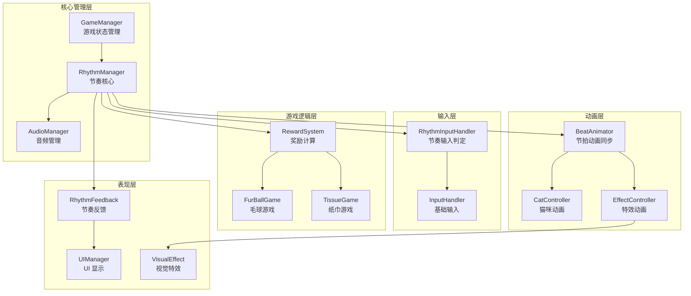
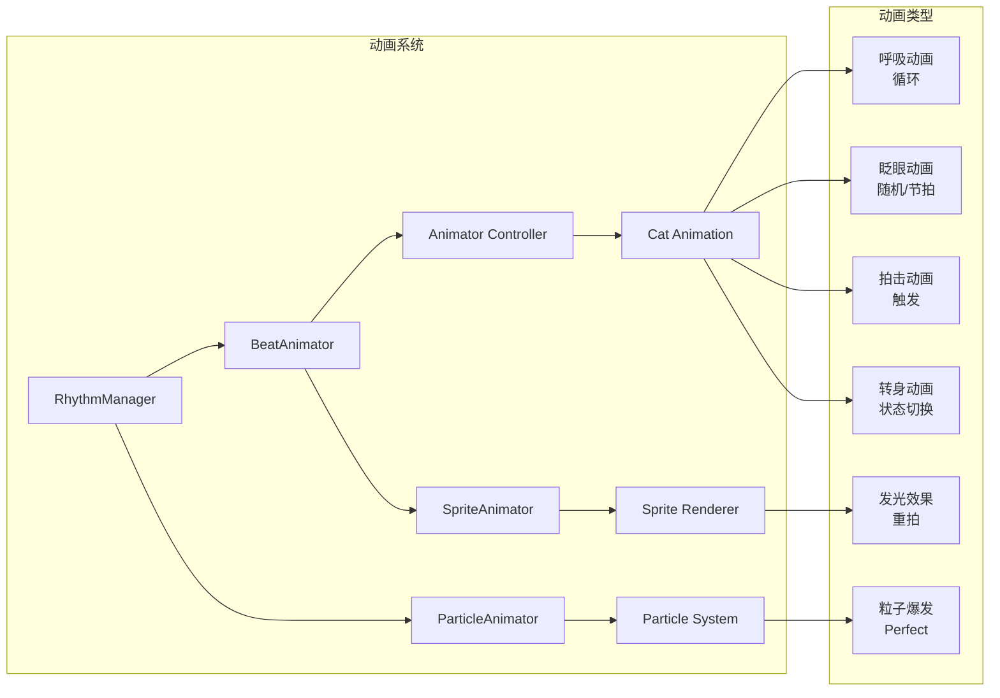
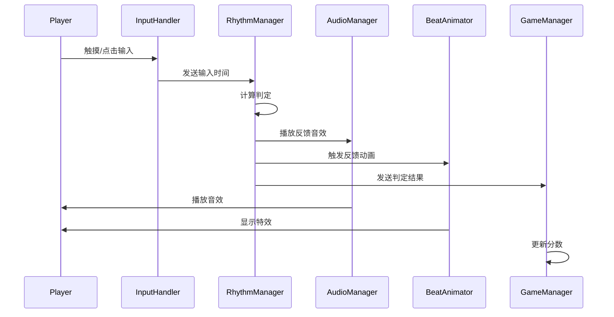
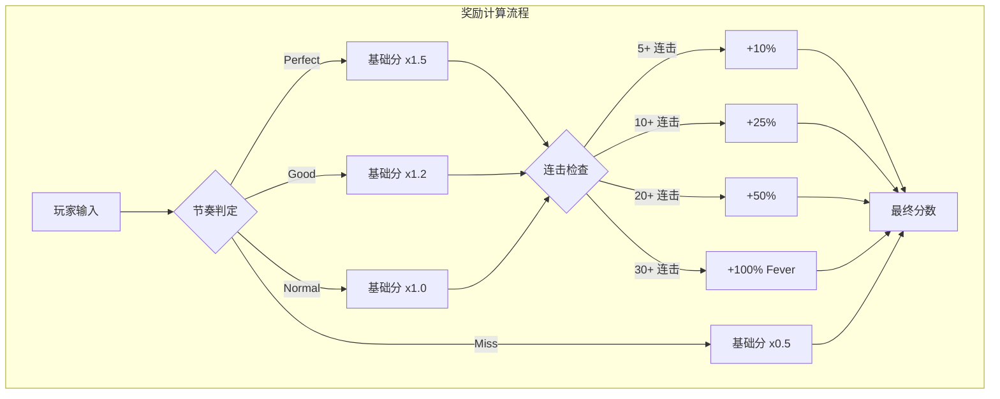
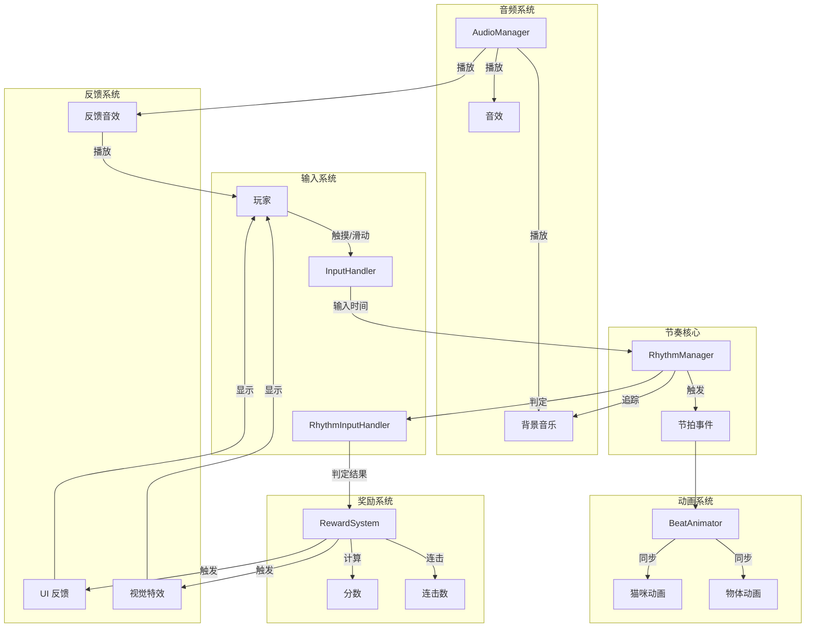

# 节奏天国风格游戏设计文档

## 问题 1：音乐制作方案

### 我的能力限制
我无法直接生成音频文件（.wav, .mp3 等）。音乐需要由外部来源提供。

### 推荐方案：AI 音乐生成工具

以下是推荐的 AI 音乐生成工具，适合制作节奏天国风格的游戏音乐：

| 工具 | 网址 | 特点 | 价格 |
|------|------|------|------|
| **AIVA** | aiva.ai | 古典/电子音乐，可导出 MIDI | 免费/付费 |
| **Soundraw** | soundraw.io | 可自定义 BPM、风格、时长 | 订阅制 |
| **Beatoven** | beatoven.ai | 情绪驱动，可分段导出 | 免费/付费 |
| **Suno AI** | suno.ai | AI 歌曲生成，风格多样 | 免费/付费 |
| **Udio** | udio.com | 高质量 AI 音乐生成 | 免费/付费 |
| **Stable Audio** | stableaudio.com | Stability AI 出品 | 免费/付费 |

### 音乐技术规格要求

使用 AI 工具生成音乐时，请使用以下参数：

```
┌─────────────────────────────────────────────────────────┐
│ 音乐技术规格                                            │
├─────────────────────────────────────────────────────────┤
│ BPM: 100-120 (休闲向，类似节奏天国的中等速度)           │
│ 拍号：4/4 拍 (强 - 弱 - 次强 - 弱)                      │
│ 时长：30-60 秒 (每个小游戏时长)                         │
│ 风格：Lo-fi Hip Hop / Chill / Funky                    │
│ 结构：Intro(4 小节) + Loop(8-16 小节) + Outro(2 小节)   │
│ 节拍强调：明显的鼓点/军鼓/踩镲                        │
└─────────────────────────────────────────────────────────┘
```

### 音乐分段建议

为了便于游戏集成，建议生成以下分段：

```
┌────────────────────────────────────────────────────────┐
│ 音乐分段结构                                           │
├────────────────────────────────────────────────────────┤
│ Intro (前奏):    4 小节 - 游戏准备阶段                  │
│ Verse A (主歌):  8 小节 - 正常游戏阶段                  │
│ Chorus (副歌):   8 小节 - 高潮/连击阶段                │
│ Bridge (间奏):   4 小节 - 过渡                          │
│ Verse B (主歌):  8 小节 - 继续游戏                      │
│ Outro (尾奏):    2 小节 - 游戏结束                      │
└────────────────────────────────────────────────────────┘
```

### 推荐提示词 (Prompt)

使用 AI 工具时，可以使用以下提示词：

```
"Upbeat lo-fi hip hop track, 110 BPM, 4/4 time signature, 
catchy drum pattern with strong snare on beats 2 and 4, 
clear hi-hat on every eighth note for rhythm guidance, 
playful and cute melody, suitable for casual rhythm game, 
30 seconds loopable"
```

---

## 问题 2：统筹设计方案

### 整体架构图



---

### 核心系统详细设计

#### 1. RhythmManager - 节奏核心

```csharp
/// <summary>
/// 节奏管理器 - 单例
/// 负责追踪音乐节拍、判定输入时机、触发节拍事件
/// </summary>
public class RhythmManager : MonoBehaviour
{
    // 音乐配置
    [Header("音乐设置")]
    [SerializeField] private float bpm = 110f;           // 节拍速度
    [SerializeField] private int beatsPerMeasure = 4;    // 每小节拍数
    [SerializeField] private float audioOffset = 0f;     // 音频延迟补偿
    
    // 判定窗口
    [Header("判定窗口 (秒)")]
    [SerializeField] private float perfectWindow = 0.05f;  // ±50ms
    [SerializeField] private float goodWindow = 0.10f;     // ±100ms
    [SerializeField] private float normalWindow = 0.20f;   // ±200ms
    
    // 当前状态
    private float currentBeatTime;         // 当前节拍时间
    private int currentBeat;               // 当前节拍编号
    private int currentMeasure;            // 当前小节编号
    private float beatDuration;            // 每拍时长
    
    // 事件
    public event Action<int, int> OnBeatHit;        // 节拍命中事件 (beat, measure)
    public event Action<int> OnMeasureStart;        // 新小节开始
    public event Action<RhythmJudgment, int> OnInputJudged; // 输入判定事件
    
    // 连击系统
    private int currentCombo;
    private int maxCombo;
    private float comboMultiplier = 1f;
    
    void Start()
    {
        beatDuration = 60f / bpm;
        currentBeatTime = -audioOffset; // 考虑延迟补偿
    }
    
    void Update()
    {
        // 更新节拍追踪
        currentBeatTime += Time.deltaTime;
        
        // 检测是否到达新节拍
        if (currentBeatTime >= beatDuration)
        {
            currentBeat++;
            currentBeatTime -= beatDuration;
            
            // 检查新小节
            if (currentBeat % beatsPerMeasure == 0)
            {
                currentMeasure++;
                OnMeasureStart?.Invoke(currentMeasure);
            }
            
            // 触发节拍事件
            OnBeatHit?.Invoke(currentBeat, currentMeasure);
        }
    }
    
    /// <summary>
    /// 判定玩家输入
    /// </summary>
    public RhythmJudgment JudgeInput(float inputTime, out float timingOffset)
    {
        timingOffset = currentBeatTime - inputTime;
        float absOffset = Mathf.Abs(timingOffset);
        
        if (absOffset <= perfectWindow)
            return RhythmJudgment.Perfect;
        if (absOffset <= goodWindow)
            return RhythmJudgment.Good;
        if (absOffset <= normalWindow)
            return RhythmJudgment.Normal;
        return RhythmJudgment.Miss;
    }
    
    /// <summary>
    /// 处理输入并计算奖励
    /// </summary>
    public void ProcessRhythmInput(float inputTime)
    {
        var judgment = JudgeInput(inputTime, out float offset);
        
        if (judgment != RhythmJudgment.Miss)
        {
            currentCombo++;
            UpdateComboMultiplier();
        }
        else
        {
            currentCombo = 0;
            comboMultiplier = 1f;
        }
        
        OnInputJudged?.Invoke(judgment, currentCombo);
    }
    
    private void UpdateComboMultiplier()
    {
        // 连击倍率计算
        if (currentCombo >= 30) comboMultiplier = 2.0f;  // Fever
        else if (currentCombo >= 20) comboMultiplier = 1.5f;
        else if (currentCombo >= 10) comboMultiplier = 1.3f;
        else if (currentCombo >= 5) comboMultiplier = 1.1f;
    }
    
    /// <summary>
    /// 获取当前节拍在小节中的位置 (0-3)
    /// </summary>
    public int GetBeatInMeasure() => currentBeat % beatsPerMeasure;
    
    /// <summary>
    /// 检查是否是强拍 (第 1 拍)
    /// </summary>
    public bool IsStrongBeat() => GetBeatInMeasure() == 0;
}
```

---

#### 2. 动画统筹设计



**动画同步策略：**

| 动画类型 | 同步方式 | 触发时机 |
|----------|----------|----------|
| 呼吸动画 | 半速循环 | 2 拍一次呼吸 |
| 眨眼动画 | 随机 + 节拍 | 每 4 小节或随机 |
| 拍击动画 | 精确同步 | 玩家输入时 |
| 发光效果 | 重拍触发 | 第 1 拍 (强拍) |
| 粒子特效 | 判定触发 | Perfect/Good 时 |

**BeatAnimator 组件设计：**

```csharp
/// <summary>
/// 节拍动画同步器
/// 将节奏事件转换为动画触发
/// </summary>
public class BeatAnimator : MonoBehaviour
{
    [Header("动画组件引用")]
    [SerializeField] private Animator catAnimator;
    [SerializeField] private SpriteRenderer targetSprite;
    [SerializeField] private ParticleSystem perfectEffect;
    
    [Header("动画设置")]
    [SerializeField] private string breathTrigger = "Breath";
    [SerializeField] private string pawTrigger = "Paw";
    
    [Header("节拍同步设置")]
    [SerializeField] private bool syncToStrongBeat = true;  // 只同步强拍
    [SerializeField] private int beatInterval = 1;          // 每隔几拍触发
    
    private int beatCounter = 0;
    private RhythmManager rhythmManager;
    
    void Awake()
    {
        rhythmManager = FindObjectOfType<RhythmManager>();
    }
    
    void OnEnable()
    {
        rhythmManager.OnBeatHit += HandleBeat;
        rhythmManager.OnInputJudged += HandleJudgment;
    }
    
    void OnDisable()
    {
        rhythmManager.OnBeatHit -= HandleBeat;
        rhythmManager.OnInputJudged -= HandleJudgment;
    }
    
    void HandleBeat(int beat, int measure)
    {
        beatCounter++;
        
        // 强拍检测
        if (syncToStrongBeat && rhythmManager.IsStrongBeat())
        {
            // 发光效果
            StartCoroutine(FlashSprite());
        }
        
        // 节拍间隔触发
        if (beatCounter % beatInterval == 0)
        {
            // 触发呼吸动画
            catAnimator?.SetTrigger(breathTrigger);
            beatCounter = 0;
        }
    }
    
    void HandleJudgment(RhythmJudgment judgment, int combo)
    {
        switch (judgment)
        {
            case RhythmJudgment.Perfect:
                perfectEffect?.Play();
                catAnimator?.SetTrigger(pawTrigger);
                break;
            case RhythmJudgment.Good:
                // 轻微效果
                break;
        }
    }
    
    IEnumerator FlashSprite()
    {
        Color originalColor = targetSprite.color;
        targetSprite.color = Color.white;
        yield return new WaitForSeconds(0.1f);
        targetSprite.color = originalColor;
    }
}
```

---

#### 3. 玩家交互与音频节奏同步



**输入处理流程：**

```csharp
/// <summary>
/// 节奏输入处理器
/// </summary>
public class RhythmInputHandler : MonoBehaviour
{
    [Header("输入设置")]
    [SerializeField] private InputHandler baseInputHandler;
    
    private RhythmManager rhythmManager;
    
    void Awake()
    {
        rhythmManager = FindObjectOfType<RhythmManager>();
    }
    
    void OnEnable()
    {
        // 订阅基础输入事件
        if (baseInputHandler != null)
        {
            baseInputHandler.OnTap += HandleTapInput;
            baseInputHandler.OnSwipe += HandleSwipeInput;
        }
    }
    
    void OnDisable()
    {
        if (baseInputHandler != null)
        {
            baseInputHandler.OnTap -= HandleTapInput;
            baseInputHandler.OnSwipe -= HandleSwipeInput;
        }
    }
    
    void HandleTapInput(Vector2 position)
    {
        // 将输入时间传递给节奏管理器
        rhythmManager.ProcessRhythmInput(Time.time);
    }
    
    void HandleSwipeInput(Vector2 position, SwipeDirection direction)
    {
        // 滑动输入也进行节奏判定
        rhythmManager.ProcessRhythmInput(Time.time);
    }
}
```

---

#### 4. 奖励系统统筹设计



**奖励系统组件：**

```csharp
/// <summary>
/// 节奏奖励系统
/// </summary>
public class RhythmRewardSystem : MonoBehaviour
{
    [Header("分数设置")]
    [SerializeField] private int baseScore = 100;       // 基础分数
    [SerializeField] private int perfectBonus = 50;     // Perfect 额外加分
    
    [Header("连击奖励")]
    [SerializeField] private AnimationCurve comboMultiplierCurve;  // 连击倍率曲线
    
    private int currentScore;
    private int currentCombo;
    private float currentMultiplier = 1f;
    
    // 事件
    public event Action<int, int, float> OnScoreUpdated;  // 分数更新事件
    
    /// <summary>
    /// 处理节奏判定并计算分数
    /// </summary>
    public void ProcessJudgment(RhythmJudgment judgment, int combo)
    {
        // 基础分数计算
        float judgmentMultiplier = GetJudgmentMultiplier(judgment);
        
        // 连击倍率
        currentMultiplier = GetComboMultiplier(combo);
        
        // 最终分数
        int score = Mathf.RoundToInt(baseScore * judgmentMultiplier * currentMultiplier);
        
        if (judgment != RhythmJudgment.Miss)
        {
            currentScore += score;
            currentScore += perfectBonus * (judgment == RhythmJudgment.Perfect ? 1 : 0);
        }
        
        OnScoreUpdated?.Invoke(currentScore, combo, currentMultiplier);
    }
    
    float GetJudgmentMultiplier(RhythmJudgment judgment)
    {
        return judgment switch
        {
            RhythmJudgment.Perfect => 1.5f,
            RhythmJudgment.Good => 1.2f,
            RhythmJudgment.Normal => 1.0f,
            RhythmJudgment.Miss => 0.5f,
            _ => 1.0f
        };
    }
    
    float GetComboMultiplier(int combo)
    {
        if (combo >= 30) return 2.0f;   // Fever
        if (combo >= 20) return 1.5f;
        if (combo >= 10) return 1.3f;
        if (combo >= 5) return 1.1f;
        return 1.0f;
    }
}
```

---

### 完整数据流图



---

## 总结

### 音乐制作
- 使用 AI 工具（Soundraw、AIVA、Beatoven 等）生成
- 规格：110 BPM, 4/4 拍，30-60 秒，Lo-fi/Funky 风格
- 需要明显的鼓点便于节奏追踪

### 统筹设计核心
1. **RhythmManager** 作为节奏核心，追踪音乐节拍
2. **BeatAnimator** 将节拍事件转换为动画触发
3. **RhythmInputHandler** 将玩家输入与节奏同步
4. **RhythmRewardSystem** 根据节奏判定计算奖励

### 关键同步点
- 动画在重拍时触发视觉效果
- 输入判定基于音乐节拍时间
- 奖励倍率与连击数挂钩
- 所有系统通过事件解耦
